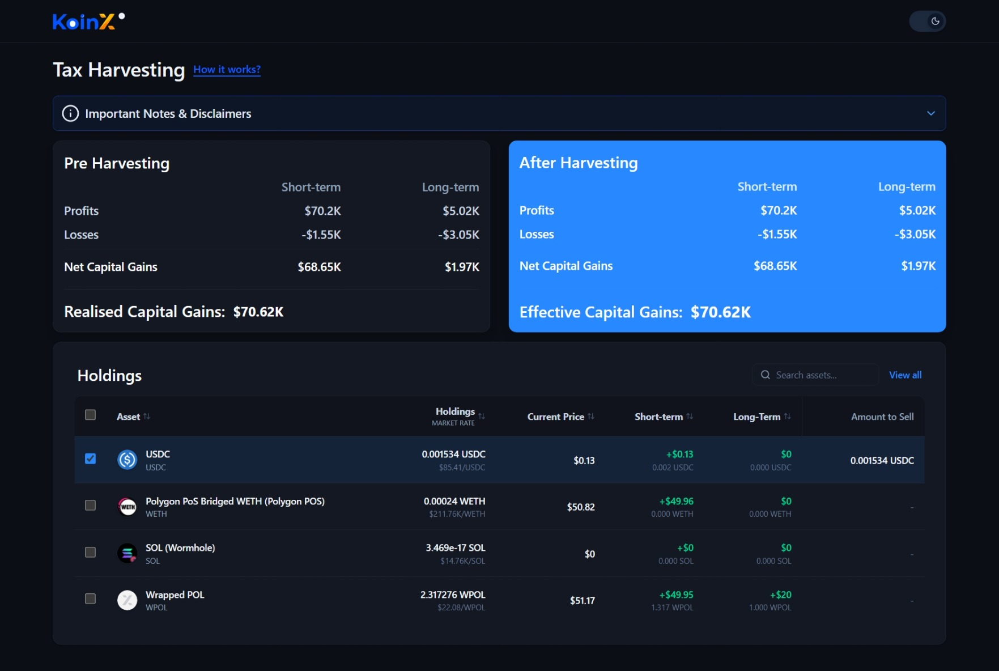
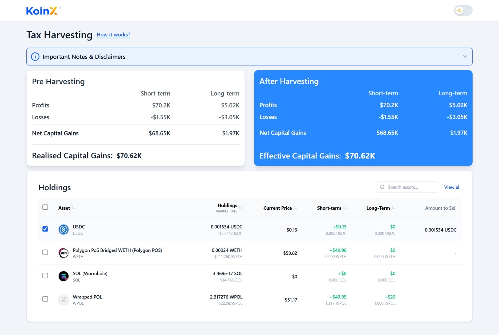
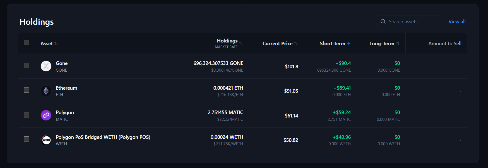
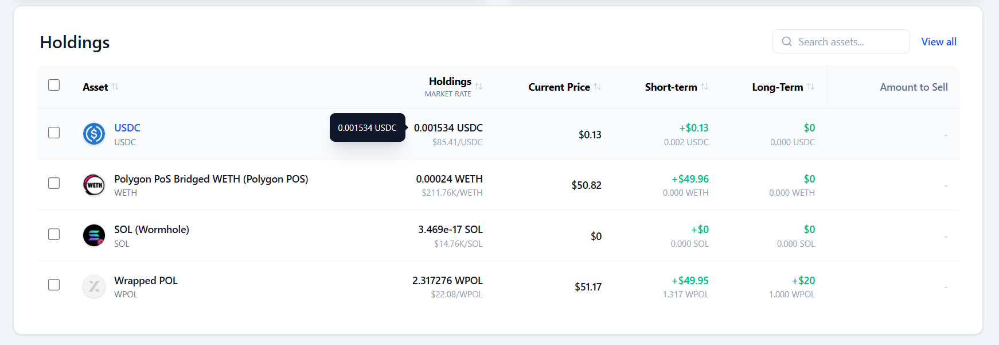
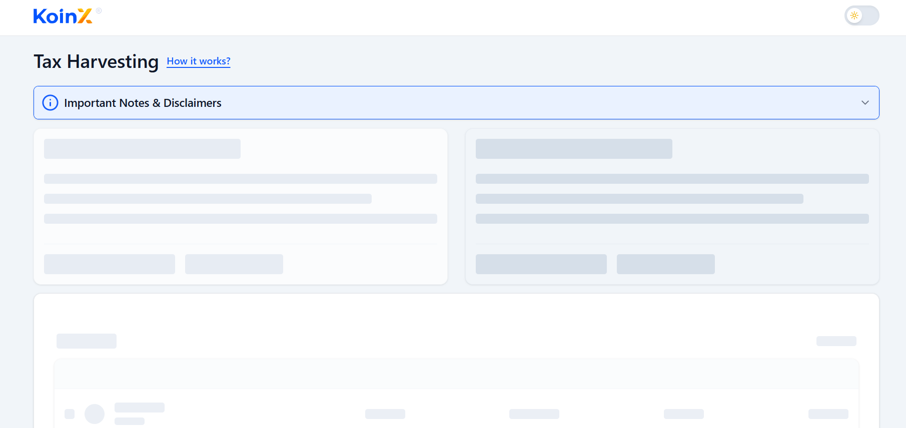
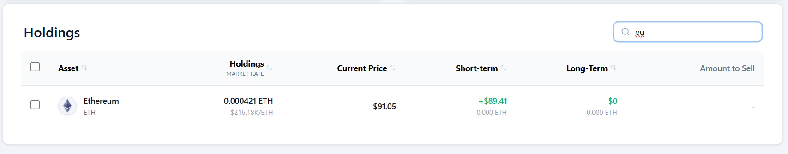

# 🚀 KoinX – AI Tax Harvesting Dashboard

A high-performance financial dashboard designed to help cryptocurrency investors **minimize tax liability** through intelligent **Tax Loss Harvesting**.

The platform identifies **loss-making assets (underwater positions)** and allows users to offset gains, resulting in **optimized tax outcomes** — all through a clean, responsive, and modern UI.

---

## ✨ Key Features

###  Adaptive Theme Engine

* Seamless **Dark Mode & Light Mode** with persistent user preference
* Custom **KoinX color palette** (Midnight Navy, Slate tones, Brand Blue)
* Optimized `color-scheme` for native UI elements (checkboxes, scrollbars)

---

###  Advanced Portfolio Management

* **High Precision Support**: Handles scientific notation (e.g., `3.46e-17`)
* **Dynamic Search**: Instantly filter assets by name or symbol

---

###  Tax Harvesting Logic

* Clear breakdown of:

  * **Short-Term Capital Gains (STCG)**
  * **Long-Term Capital Gains (LTCG)**
* **Interactive Selection System**:

  * Select assets to simulate selling
  * Real-time recalculation of gains and losses
* **Optimized Tax Insight**:

  * Instantly see reduced taxable gains
  * Highlight potential **tax savings**

---

### ⚡ Professional UI/UX

* **Custom Tooltips** for precise financial data
* **Skeleton Loaders** for smooth loading experience
* Clean, minimal table design for a **premium dashboard feel**
* Fully **responsive layout** (desktop + mobile)

---

## 🛠️ Tech Stack

### Frontend

* **React (Vite)** + **TypeScript**
* **Redux Toolkit** – Global state management
* **Tailwind CSS** – Utility-first styling
* **Lucide React** – Icon system
* **Context API** – Theme management

---

### Utilities & Helpers

* **Intl.NumberFormat** – Currency formatting
* **Custom SmartFormat Utility** – Handles:

  * Extreme decimal precision
  * Scientific notation values

---

## 🧠 Core Concepts Implemented

* Tax Loss Harvesting Simulation
* Real-time Financial Calculations
* Optimized State Synchronization
* Clean Component Architecture

---

## 🚀 Getting Started

### 1. Clone the repository

```bash
git clone https://github.com/sushant785/Tax-Harvesting-Dashboard.git
cd koinx-dashboard
```

### 2. Install dependencies

```bash
npm install
```

### 3. Run the development server

```bash
npm run dev
```


---

## 📸 Screenshots

### 🌓 Theme Experience
<table width="100%">
  <tr>
    <td width="50%" align="center">
      <br/>
      <b>Dark Mode Dashboard</b>
    </td>
    <td width="50%" align="center">
      <br/>
      <b>Light Mode Dashboard</b>
    </td>
  </tr>
</table>

### 📊 Data & Interaction
<table width="100%">
  <tr>
    <td width="50%" align="center">
      <br/>
      <b>Clean Table UI with Sort </b>
    </td>
    <td width="50%" align="center">
      <br/>
      <b>Intelligent Data Tooltips</b>
    </td>
  </tr>
  <tr>
    <td width="50%" align="center">
      <br/>
      <b>Dark Mode Skeleton Loaders</b>
    </td>
    <td width="50%" align="center">
      <br/>
      <b>Real-time Asset Search</b>
    </td>
  </tr>
</table>

---

## 📌 Assumptions

* Data is mocked using static APIs
* No real-time crypto API integration
* Focus is on frontend logic and UI/UX

---

## 🏆 Highlights

* Clean and scalable architecture
* Real-world financial logic implementation
* Production-level UI/UX practices
* Performance-focused rendering

---

## 📬 Submission

* GitHub Repository: https://github.com/sushant785/Tax-Harvesting-Dashboard.git

---

## 📄 License

This project is built for assignment purposes and demonstration of frontend engineering skills.

